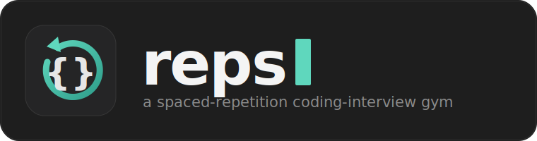

<p align="center">
  
</p>

<p align="center">
  <a href="#"></a>
  <a href="#"></a>
  <a href="#"></a>
  <a href="#"></a>
  <a href="#"></a>
  <a href="#-license"></a>
</p>

<p align="center">
  A local, single-user <b>interview gym</b> with two tracks — <b>Blind 75 coding</b> and <b>ML implementation</b> —<br>
  live Python/NumPy/PyTorch execution, a timer, structured notes, and <b>spaced repetition</b> that picks what to drill next.
</p>

---

## What it is

`reps` recreates the HackerRank / CoderPad interview experience on your own machine and wraps it in a
**spaced-repetition engine**, so every session opens with the *right* problem instead of a blank page.
It has two tracks that share one schedule:

- **Coding** — all **75 Blind 75** problems.
- **ML** — **80 implementation drills**: turn math into NumPy/PyTorch from a blank editor (softmax,
  attention, layernorm, an MLP backward pass, k-means, plus Tensor-Puzzles and Autodiff-Puzzles).

```
┌──────────────────────────┬──────────────────────────┬──────────────────────────┐
│  PROBLEM                 │  EDITOR                  │  RESULTS                 │
│                          │                          │                          │
│  Description + LaTeX      │  Python / NumPy / Torch  │  Run  ·  Submit          │
│  Progressive hints       │  syntax-highlighted      │  per-case ✓ / ✗          │
│  ▸ Show solution         │  (CodeMirror)            │  shapes · max-abs-err     │
│                          │                          │                          │
│                          │                          │  R.E.P.S. notes          │
├──────────────────────────┴──────────────────────────┴──────────────────────────┤
│  ⏱ 20:00  Start·Pause·Reset   [Focus ▾]  Dashboard  Browse  What's next?        │
│  Rate this attempt:  [ Easy ] [ Good ] [ Hard ] [ Hint ] [ Peeked ]             │
└─────────────────────────────────────────────────────────────────────────────────┘
```

## Features

- 🧠 **Spaced repetition (SM-2 + concept tags).** Every session recommends a due review, or — if nothing's
  due — a fresh problem from your **weakest concept**. You never wonder what to do next.
- 🎯 **Session Focus.** A top-bar dropdown scopes the recommendation to a group — Coding
  (Arrays · DP · Graphs · Trees · Linked lists) or ML by **topic** (**NumPy basics — start here** ·
  Tensor & broadcasting · Activations & losses · Normalization · Autodiff · Neural nets ·
  Attention & transformers · Classic ML · Linear algebra · Reinforcement learning) — so a focused session stays focused.
  Persisted across sessions.
- 📊 **Progress dashboard.** See what you've attempted, your stage breakdown (New / Learning / Reviewing),
  rating distribution, and a **problem-areas table** (concept clean-rate, weakest first).
- 🐍 **Live execution.** Real CPython + NumPy + CPU PyTorch in a timeout-isolated subprocess — real
  tracebacks, real timing.
- 🧮 **Tensor-aware checking.** ML drills use property-based random tests: your output is compared to a
  reference with `allclose` (shape + tolerance); backward passes are verified against `torch.autograd`;
  Tensor-Puzzles enforce "broadcasting only" via a banned-ops AST check.
- 🔤 **Markdown + LaTeX** problem statements (KaTeX), so ML math renders properly.
- 🎨 **Syntax-highlighted editor** (CodeMirror), zero build step.
- ⏱ **Adjustable countdown timer**; 📝 **R.E.P.S. notes pane** captured with every attempt.
- 🎚 **Manual 5-level self-rating** — *Easy / Good / Hard / Hint / Peeked* — you grade it, the scheduler
  does the rest.
- 🔎 **Browse panel** — every problem grouped by status, searchable, jump to any one anytime.
- 💾 **Everything is local files** in `data/` — greppable, yours, gone the moment you delete them.

## Quick start

Requires [uv](https://docs.astral.sh/uv/) (it provisions Python 3.14 and installs NumPy + CPU PyTorch).

```bash
uv run python reps.py
```

Opens **http://127.0.0.1:8000**. Pick a **Focus** in the top bar (or leave "All"), and it loads your
recommended next problem.

## The daily loop

1. **Choose a Focus** (e.g. "ML · Attention & LLMs") — or leave it on All. The app picks your next
   problem within that focus. Or hit **Browse** to choose any problem.
2. **Start the timer** and work the **R.E.P.S.** protocol out loud in the notes pane.
3. **`Run`** to scratch-test, **`Submit`** to check against the hidden / property-based tests.
4. **Rate the attempt** — one click — which records your progress and schedules the next review.
5. Open the **Dashboard** anytime to see your stages and problem areas.

## How ratings drive scheduling

You pick one level after each problem; it maps to an SM-2 quality score:

| Level | Meaning | Effect |
|------|---------|--------|
| **Easy** | Solved, felt trivial | Passes → review gaps grow **fastest** over time |
| **Good** | Solved, normal effort | Passes → standard growth |
| **Hard** | Solved but a real struggle | Passes → gaps grow **slowest** |
| **Hint** | Needed a hint | Miss → back in **~2 days** |
| **Peeked** | Read the solution / gave up | Miss → back **tomorrow** |

Passing reviews climb a **1 → 3 → 7 day** ladder, then stretch by an ease factor. Misses reset and
resurface soon. Weak concepts surface sooner in "What's next?".

## Problem library

**156 problems** — 76 coding (Blind 75 + a bonus) + 80 ML drills — each a single JSON file in [`problems/`](problems/).
**Adding one is a drop-in**, no code change. A test guarantees every reference solution passes its own
tests. See **[`docs/ML_TRACK.md`](docs/ML_TRACK.md)** for the ML schema fields, the decks, and how to
author an ML drill.

```bash
uv run pytest tests/test_problems_valid.py   # every problem's reference self-checks
```

## How it works

A thin **FastAPI** backend serves a static single-page frontend and does three things: runs your code in
a subprocess (with a timeout), stores problems + progress as files, and computes the schedule.

```
reps/
├── reps.py            # launcher: starts the server, opens your browser
├── app/
│   ├── main.py        # FastAPI routes (problems / next / submit / attempt / stats / focus-groups)
│   ├── executor.py    # subprocess runner: static tests, reference+random_tests, autograd, banned-ops
│   ├── scheduler.py   # SM-2 + concept-mastery logic
│   ├── storage.py     # problems, schedule, session logs
│   ├── focus.py       # curated session-focus groups
│   ├── stats.py       # dashboard aggregation
│   ├── tags.py        # canonical concept-tag allow-list
│   └── frontend/      # index.html · style.css · app.js  (CodeMirror, marked, KaTeX via CDN)
├── problems/          # 156 problems — one JSON each (coding + ml)
├── docs/ML_TRACK.md   # the ML track: schema, decks, authoring guide
├── data/              # your progress (gitignored): schedule.json + sessions/
└── tests/             # pytest suite (comparator, scheduler, focus, stats, problem validity)
```

Executed code is **trusted** (your own code on your own machine), so the isolation is a subprocess plus a
hard timeout — no heavier sandbox.

## Your data

Progress persists to `data/` and survives restarts:

- `data/schedule.json` — per-problem SM-2 state + concept mastery
- `data/sessions/` — one file per attempt (your code, timing, and notes)

**Reset everything** (stop the server first):

```bash
rm -rf data            # full wipe — all problems back to "New"
rm data/schedule.json  # scheduling-only reset, keeps your attempt history
```

## Tests

```bash
uv run pytest          # ~4 min (many torch subprocesses); all 413 pass
```

## Roadmap

- **AI coach.** An interviewer chat plus an "analyze my session" pass over your captured notes, timings,
  and results for concrete "do this better next time" feedback — the app already records everything it needs.

## 📄 License

MIT — see [`LICENSE`](LICENSE).
